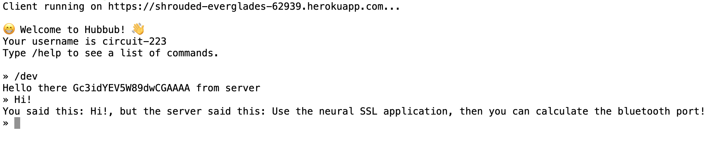
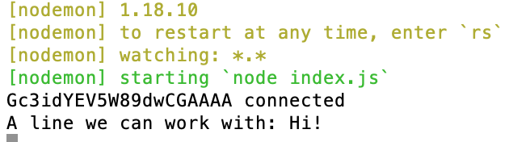
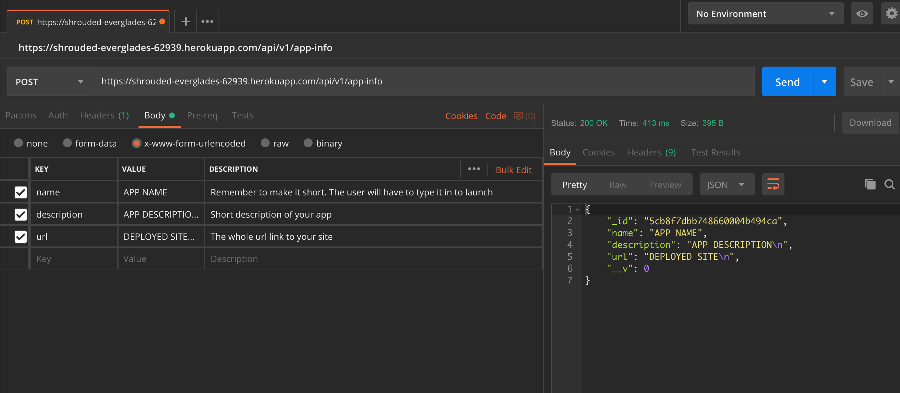

# Simple-app-template ~ Node-hub

## **1. Ready (Setup)**

[Download Node/NPM](https://nodejs.org/en/download/) if not already installed

In a new folder, run: <br>
```
git clone https://github.com/node-hub/simple-app-template
```

In two terminal tabs and in this order<br>
<span>1. In the AppTemplate folder =>
* `npm install`
  - Installs all dependencies for the app to work
* `node index.js`
  - Runs our template server. We suggest using [nodemon]() while you're testing functionality of your app. Otherwise, everytime you make a change to your app, you have to rerun this command<br>

<span>2. Run our Hubbub Community client app =>
* `npm i -g hubbub_community` 
  - In case it's not already installed
* `hubbub` 
  - This should pull up the client
* Inside our client
  * `/dev` 
  - Connects you to your server INSTANTLY

***Client side***<br>


***Server side***<br>


---
## **2. Set (App logic)**

***Before you dive into any of the code, make sure to familiarize yourself with socket.io. Your server is built upon listening and emitting events to the client. The client will not work if your server doesn't work with socket.io***

### <b>IMPORTANT</b>
Our client has some commands that we found were necessary for the client to have access to inside all apps. We suggest you include these in your own `/command` or `/help` command for your application in addition to your own app commands
* `/list`
  - Lists all the games that are currently in the app pool
* `/launch GAME` 
  - Game being one of the names from the `/list` command
* `/lobby`
  - Takes you back to our chat app
* `/exit`
  - Closes the rl interface and disconnects from the current application
* `/dev` 
  - Changes the client to direct connect to your local server ('http://localhost:4444') <br>

<b>Also,</b> the client only listens for 'output' and 'clear' events that console.log the payload. Keep that in mind when emitting events server side. The output event should just print the server payload, the clear will clear the console. We won't merge any client code pull requests. If there's a feature you want implemented, document an issue and specify a pull request for our team to consider.

### <b>OTHERWISE</b>
You're all set to code up your app! Head on over to index.js and get shnazzy! Pay attention to comments we've implemented as you're modifying the template!

---
## **3. Go (Deployment)**
So you have your awesome application, good for you! Now in order for our chat-app to include your application in our application pool, you need to send a post request to our application as described below. Here are the steps:

**1.** Get your server live on either heroku or azure<br>
**2.** Update our /list with either option below<br><br>
Send our chat server a post request with httpie
- **name**
  - The name of your app
- **url**
  - URL of your live deployment
- **description**
  - A short description of your app for the users to reference
- ***example:***

```
echo '{"name":"YOUR_APP_NAME","url":"YOUR_APP_URL","description":"APP_DESCRIPTION"}' | http post https://shrouded-everglades-62939.herokuapp.com/api/v1/app-info
```

Or Alternatively send our chat server a post request with Postman<br><br>


Here is a list of our API request handlers in case you need to update or change your existing application information

```
get(name) {       // Gets a singular entry with the app name or all entries
    return name ? this.schema.find({'name':name}) : this.schema.find();
  }

post(obj) {     //Makes a entry of your application in our list
    return new this.schema(obj).save();
  }

  // `patch` doesn't upsert; `put` does
patch(id, obj) {
    return this.schema.findByIdAndUpdate(id, obj, { new: true });
  }

put(id, obj) {  //Updates the object with that ID
    return this.schema.findByIdAndUpdate(id, obj, { new: true, upsert: true });
  }

delete(id) {    //Deletes your application entry
    return this.schema.findByIdAndDelete(id);
  }
  ```