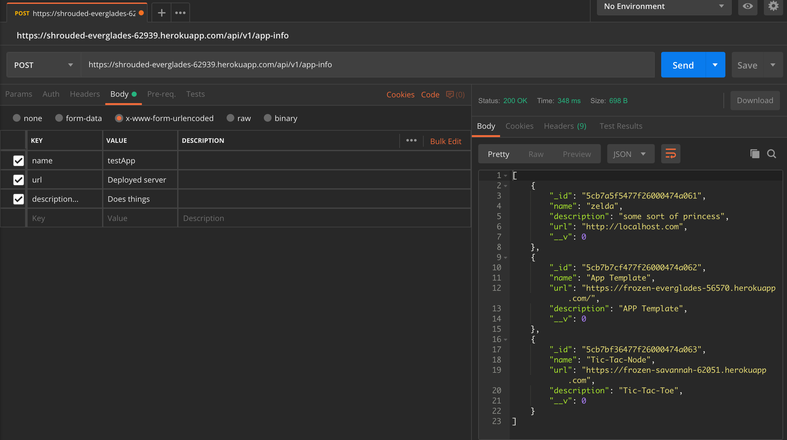

# Simple-app-template ~ Node-hub

## 1. Ready (Setup)

[Download Node/NPM](https://nodejs.org/en/download/) if not already installed

In a new folder, run: <br>
`git clone https://github.com/node-hub/AppTemplate`<br>
`git clone https://github.com/node-hub/dumb-client`

In two terminal tabs and in this order
1. In the AppTemplate folder =>
* `npm install`
* `node index.js`

2. In the Simple-app-template folder => 
* `npm install`
* `node index.js`
    - Should pull up our client
    - type command `/launch http://localhost:4444` ~ Changes socket to direct connect to your server (could be a different port if you changed the default)
<br>
You should be able to see on the client a bunch of messages every second if everything is connected!

## 2. Set (App logic)
#### IMPORTANT
Our client has some commands that we found were necessary for the client to have access to inside all apps. We suggest you include these in a '/command' or a '/help' command for your application in addition to your app commands
* `/list`       ~ Lists all the games that are currently in the app pool
* `/launch url` ~ `url` being the address of the deployed or local app
* `/lobby`      ~ Takes you back to our chat app
* `/exit`       ~ Closes the rl interface and disconnects from the current application
<br>
Also, the client only listens for 'output' and 'clear' events. Keep that in mind when formatting your logic. The output event should just print the server payload, the clear will clear the console. We won't merge any client code pull requests.

#### Otherwise
You're all set to code up your app! Pay attention to comments we've implemented as you're modifying the template!

## 3. Go (Deployment)
So you have your awesome application, good for you! Now in order for our chat-app to include your application in our application pool, you need to send a post request to our application as described below. Here are the steps:

1. Get your server live on either heroku or azure
2. Send our chat server a post request with http
    - App name       ~ The name of your app
    - App URL        ~ URL of your live deployment
    - Description    ~ A short description of your app for the users to reference
    * example: `echo '{"name":"YOUR_APP_NAME","url":"YOUR_APP_URL","description":"APP_DESCRIPTION"}' | http post https://shrouded-everglades-62939.herokuapp.com`

Or optionally<br>
2. Send our chat server a post request with Postman



Here is a list of our API request handlers in case you need to update or change your existing application information
```
get(id) {       // Gets a singular entry with the ID or all entries
    return id ? this.schema.findById(id) : this.schema.find();
  }

post(obj) {     //Makes a entry of your application in our list
    return new this.schema(obj).save();
  }

  // `patch` doesn't upsert; `put` does
patch(id, obj) {
    return this.schema.findByIdAndUpdate(id, obj, { new: true });
  }

put(id, obj) {  //Updates the object with that ID
    return this.schema.findByIdAndUpdate(id, obj, { new: true, upsert: true });
  }

delete(id) {    //Deletes your application entry
    return this.schema.findByIdAndDelete(id);
  }
  ```
